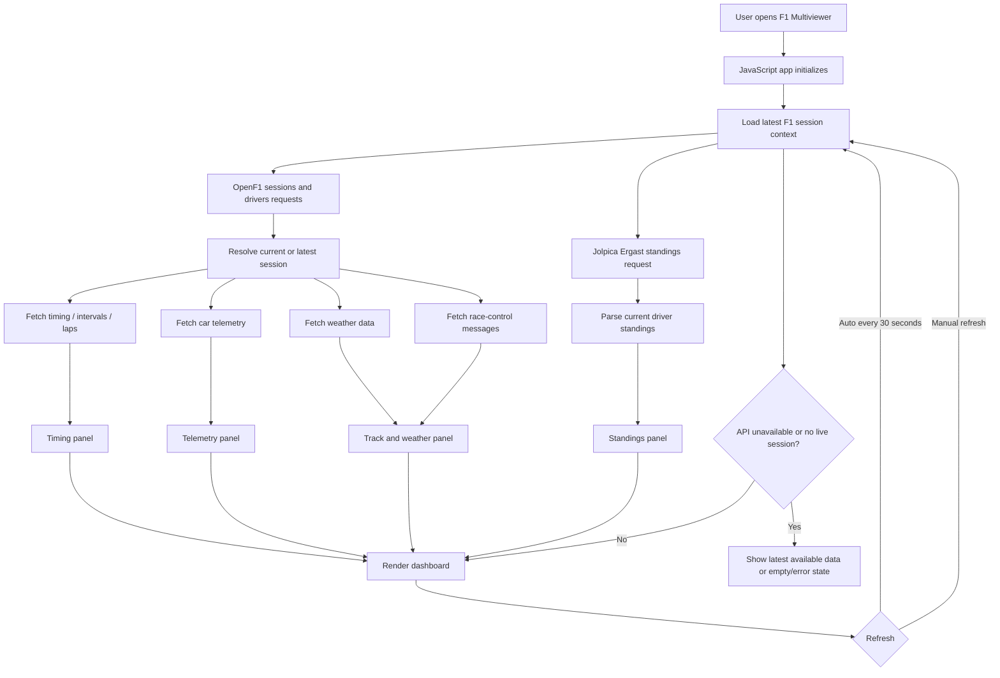

# F1 Multiviewer

F1 Multiviewer is a lightweight Formula 1 dashboard that brings timing, standings, telemetry, and weather into one browser view.

It is built with vanilla HTML, CSS, and JavaScript, using live racing data from OpenF1 and current championship standings from Jolpica Ergast.

## Highlights

- Live session timing with positions, lap data, and team colors
- Current driver standings
- Car telemetry for the leading driver, including speed, gear, RPM, throttle, brake, and DRS
- Track and weather panel with temperatures, wind, humidity, rainfall, and race-control status
- Auto-refresh every 30 seconds with manual refresh support
- No framework or build step required

## Data Sources

- [OpenF1 API](https://openf1.org): sessions, drivers, timing, telemetry, weather, and race-control data
- [Jolpica Ergast API](https://api.jolpi.ca/ergast): current Formula 1 standings

## Workflow



### Workflow Summary

1. The browser loads the static JavaScript dashboard.
2. The app resolves the current or latest Formula 1 session using OpenF1 data.
3. OpenF1 provides session, driver, timing, telemetry, weather, and race-control data.
4. Jolpica Ergast provides current championship standings.
5. Each data stream is mapped into its own dashboard panel: timing, standings, telemetry, and weather.
6. The dashboard refreshes automatically every 30 seconds and also supports manual refresh.
7. If live data is unavailable, the app falls back to the latest available session data or shows an empty/error state.

## Tech Stack

- HTML
- CSS
- JavaScript ES modules
- OpenF1 API
- Jolpica Ergast API

## Project Structure

```text
f1-multiviewer/
|-- index.html
|-- package.json
|-- styles/
|   |-- main.css
|   |-- panels.css
|   `-- components.css
`-- src/
    |-- main.js
    |-- api.js
    |-- utils.js
    |-- assets/
    |   `-- teams.js
    `-- panels/
        |-- timing.js
        |-- standings.js
        |-- telemetry.js
        `-- weather.js
```

## Run Locally

Clone the repository:

```bash
git clone https://github.com/chandra23225/f1-multiviewer.git
cd f1-multiviewer
```

Install optional local tooling:

```bash
npm install
```

Start a local static server:

```bash
npm run dev
```

You can also use Python:

```bash
python -m http.server 8080
```

Then open:

```text
http://localhost:8080
```

ES modules require a local server, so opening `index.html` directly with `file://` is not recommended.

## Deployment

This app can be hosted on any static-site platform:

- GitHub Pages
- Netlify
- Vercel
- Cloudflare Pages

No backend server is required.

## Notes

Live data availability depends on upstream API coverage and the current Formula 1 session calendar. Outside live sessions, the dashboard may show the latest available session data.

## License

MIT
